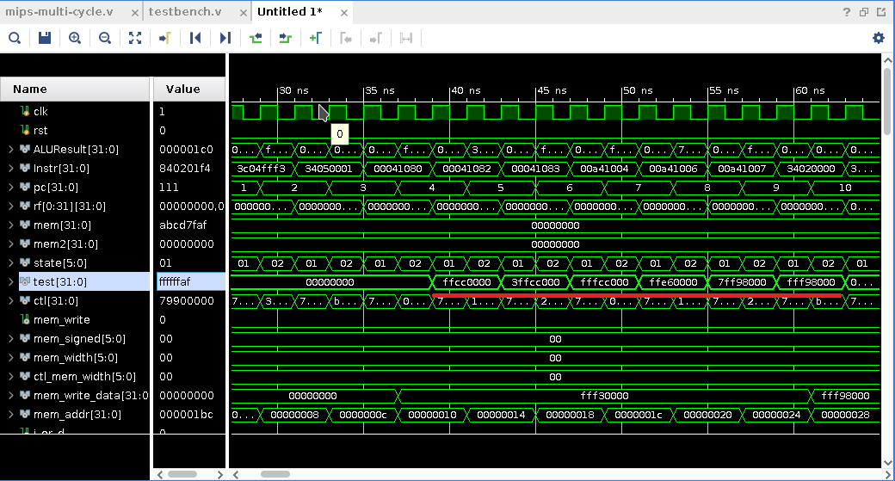
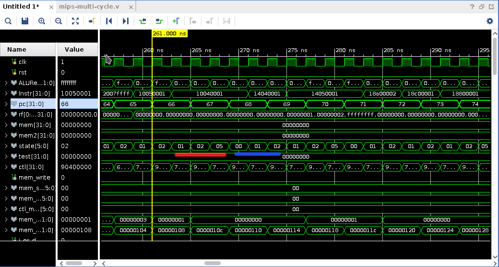
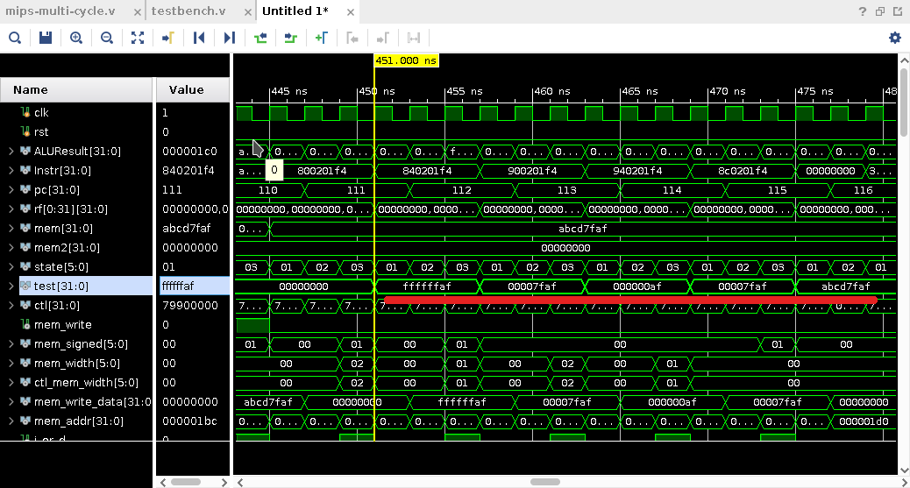
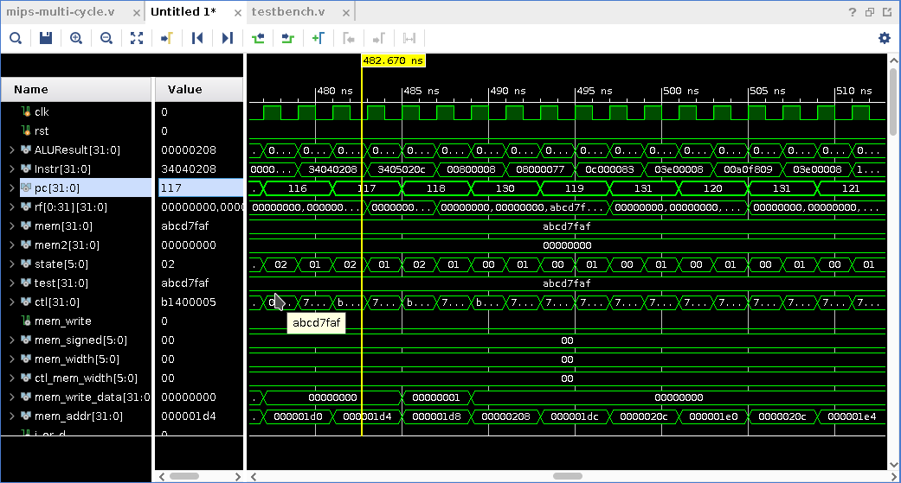

# Multi-cycle MIPS Implementation

```
multi-cycle/
|
|-- lab2-multi-cycle/: The Vivado project
|
|-- mips-multi-cycle.v: Design source
|-- testbentch.v: Simulation source
|-- constrs.v: Constraints
|
|-- test.py: Demo checker
```

## Notations

- **Hardware components** and **Highlights** are in bold.
- `Data` and `Signals` are in code block.
- *Concepts* are in italic font.


To keep it simple, I make two major changes as follows.

- Transforming the nameless states into stages as *Fetch*, *Decode*, *Write back* and *Memory*, which acts almost the same role as in pipelined CPU. Codes will soon be much more friendly with this transform, especially when I have to implement 40 instructions... Then,the Control Unit has become a *Mealy FSM*, whose next state (stage) depends not only on current state but also on current instruction.
- Classifying the instructions into 4 types, ***ALU-Type***, *Branch*, *Jump* and *Load&Store*. The last three is quite clear to understand, while *ALU-Type* is simply a collection of **both R-Type and I-Type** instructions which use ALU to calculate results and then write back to Register File, more importantly **do not need Memory**. 


## Slightly Pipelined Multi-cycle Design

### Introduction

One of the characteristics of Multi-cycle CPU is that it only has three main hardware, i.e., a **ALU**, a **Register File** and a **Memory**. However, in the classic multi-cycle design, we can easily find that only a few of these hardware is being used in each state, which indeed causes lots of waste and needs to be improved. One (also the only one, in fact) typical case of this is the pre-computed PC of next instruction. 

Thus, to address this problem, the key idea is to **make full use of** all of these (if possible) in one state, or in one *stage*, which is the term used in pipeline CPU design. 

### Implementation

The forms far below illustrate when and which of the three hardwares are used, what they are used for. 

- Cells in the form denotes which hardware is used in certain stage. 
- Rows begin with *Current Instruction* are the computations for current instruction, while rows begin with *Next Instruction* are the pre-computations for next instruction (i.e. the part of pipeline).

The *Next Stage* column in the forms below varies between *Fetch* and *Decode*. But how can we know that we can skip *Fetch* stage of next instruction and directly slide perform *Decode* stage? First we can have a closer look at each stage:

- *Fetch*: inputs nothing and outputs current instruction code
- *Decode*: inputs instruction code and outputs values specified by the instruction code. Thus, if we have known the instruction code of next instruction, then we can safely omit *Fetch* stage of next instruction.
- *Execute* are more complicated and instruction-specified. The pre-computation won't come to this stage as well as *Memory* stage in my implementation.

Notice that I have make a little change on when to pre-compute `PC+4`. **In the original version, this is perform in *Fetch*, but I have delayed it to *Decode* stage**, and this is the key point to allow my pipeline to work. We can easily verify that if we have `PC+4` performed in *Fetch* stage, we cannot jump forwards to *Decode* stage of next instruction any more unless we can pre-compute `next_PC+4` for next instruction instead.

Whether it jump to next instruction's *Decode* stage or not can sometimes be our criteria on how faster this pipelined version is.  

Now, let's have a detail look at what is happening when executing different types of instruction.

- *ALU-Type*: ADDIU, ADDU and so on

  Pre-computation for PC+4 is done in *Decode* stage and pre-fetching next instruction is done in *Execute* stage, allowing us to jump to *Decode* stage of next instruction since we have got the instruction code of next instruction. 

|   | Fetch  | Decode | Execute | Next Stage |
| - |------ | ------ | ------- | ---------- |
| Current Instruction |Memory | Register File | ALU |  |
| Next Instruction |    | ALU(PC+4) | Memory(next instr) | Decode |

- *Branch*: BEQ, BNE, BLEZ, BGTZ

  Since we should use ALU to perform at most three computation as below, I add another execute stage called *Execute Branch*.

  - Comparing values in two registers to determine whether to branch or not, which should be performed after *Decode* stage.
  - Computing the next PC for the case of branch not taken, i.e. `PC + 4`.
  - (Branch taken case) Computing the branch target, which is the actual PC in the case of branch taken.

  

  The behavior is slightly different whether branch is taken or not.

  1. Branch not taken

     With branch not taken, our pre-fetched next instruction code in *Execute* stage is exactly what we will execute. So just jump to next instruction's *Decode* stage.
  |   | Fetch  | Decode        | Execute        | Next Stage |
  | -  | ------ | ------------- | -------------- | ------------------ |
  | Current instruction | Memory | Register File | ALU(comparing) |                    |
  | Next Instruction |        | ALU(PC+4)     | Memory(next Instr) | Decode |

  2. Branch taken

     The pre-fetched instruction code is not the next instruction to execute, and we need another clock cycle to compute the branch target. Also, we cannot jump to *Decode* stage of next instruction since we haven't get the instruction code of it.

  |   | Fetch  | Decode        | Execute        | Execute Branch     | Next Stage |
  | -  | ------ | ------------- | -------------- | ------------------ | ---------- |
  | Current instruction | Memory | Register File | ALU(comparing) |                    |            |
  | Next Instruction |        | ALU(PC+4)     | Memory(next Instr) | ALU(branch target) | Fetch      |

- *Jump*: J, JR, JAL, JARL

  Unfortunately, we can not make any improvement for *Jump* instructions...

|   | Fetch  | Decode        | Next Stage |
| - | ------ | ------------- | ---------- |
| Current Instruction  | Memory | Register File |            |
| Next Instruction |        |               | Fetch      |

- *Load&Store*: LB, LH, LW, SB, SH, SW

  Notice that in *Execute* stage we need to store next instruction in another register, denoted by **MemIR**, or we will override current **IR**, making the control signals wrong in *Memory* stage which depends on the instruction stored in current **IR**.

|                     | Fetch  | Decode        | Execute                                  | Memory | Next Stage |
| ------------------- | ------ | ------------- | ---------------------------------------- | ------ | ---------- |
| Current Instruction | Memory | Register File | ALU                                      | Memory |            |
| Next Instruction    |        | ALU(PC+4)     | Memory(next instr$\rightarrow$**MemIR**) |        | Decode     |

### Summary

To sum up, the greatest improvement of such pipelined multi-cycle takes effect when dealing with *ALU-Type* and *Load&Store* instructions, making no difference for *Branch* and *Jump* instructions, since it is only a **slightly** pipelined CPU with simple pre-computed PC and pre-fetched instruction for next instruction. But it's still worthy to do so because *ALU-Type* instructions which performing calculations are executed frequently in real programs.

It's worthwhile to mention that there remains a tricky part to be optimized, i.e. pre-decoding in the *Memory* stage of *Load&Store*, which should handle the problem called *Hazards*. For the sake of time, I have not yet been able to implement it. And maybe there are some more sophisticated designs for pipelined multicycle CPU, but I think they won't be too much better, given only one **ALU**, one **Register File** and one **Memory**. 


## Demo

The demo is the same as in my implementation of Single-cycle. Recall that it is simply a random number generator, which given a seed and outputs some pseudo-random numbers in sequence, using the algorithm called *linear congruential generator* (*LCG*). We can just consider it as a function, whose input is an integer (i.e. a seed) and outputs are some random integers. A simple python program `test.py` is also provided to check the correctness of the outputs.

### Usage

- SW[0] is **Reset** trigger. During the positive edge of clock signal, PC wiil be set to 0 whenever SW[0] is 1.
- SW[1] is **Load** trigger. It will set the seed of our generator to the binary value represented by SW[15:4], if both SW[1] and SW[0] are 1. After loading, we can set SW[0] back to 0, restarting the CPU with PC at 0.
- SW[2] is **Pause** trigger. Clock signal will stop flipping and CPU will pause when SW[2] is 1.
- SW[3] is **Slower** trigger. Clock signal will slow down to about 1.4hz (i.e. about one clock cycle per second) when SW[3] is 1.


## Simulation 

All the codes below are exactly from `Instr_tb` module in `testbench.v`, where I use plenty of macro define for instructions to improve readability (e.g. `ROM` is defined as the instance of cells in **Memory**, `ORI` is 6 bits opcode of ori instruction and `r0` is 5 bits 00000 code for register r0). 

### *ALU-Type*

Since many instructions of this type have been used and tested in other simulations, there is no need to check them again. Thus I only show some less common instructions as below.

```verilog
//The program for ALU-Type
//Preparing registers
`ROM[0] = {ORI, r0, v0, 16'h0};// v0 = 0
`ROM[1] = {LUI, r0, a0, 16'hfff3};// a0 = 0xfff30000
`ROM[2] = {ORI, r0, a1, 16'h1};// a1 = 1
        
`ROM[3] = {SPECIAL, r0, a0, v0, 5'd2, SLL};// v0 = a0 << 2 = 0xffcc0000
`ROM[4] = {SPECIAL, r0, a0, v0, 5'd2, SRL};// v0 = a0 >> 2 = 0x3ffcc000
`ROM[5] = {SPECIAL, r0, a0, v0, 5'd2, SRA};// v0 = a0 >>> 2 = 0xfffcc000
    
`ROM[6] = {SPECIAL, a1, a0, v0, 5'd0, SLLV};// v0 = a0 << a1 = 0xffe60000
`ROM[7] = {SPECIAL, a1, a0, v0, 5'd0, SRLV};// v0 = a0 >> a1 = 0x7ff98000
`ROM[8] = {SPECIAL, a1, a0, v0, 5'd0, SRAV};// v0 = a0 >>> a1 = 0xfff98000
```
And my simulation result is 

<div align="center">

</div> 

This proves the correctness of shift instructions, ORI and LUI.


### *Branch*

```verilog
//The program for Branch
//Preparing registers
`ROM[60] = {ORI, r0, v0, 16'd0};// v0 = 0
`ROM[61] = {ORI, r0, a0, 16'd0};// a0 = 0
`ROM[62] = {ORI, r0, a1, 16'd1};// a1 = 1
`ROM[63] = {ORI, r0, a2, 16'd2};// a2 = 2
`ROM[64] = {ADDI, r0, a3, 16'hffff};// a3 = -1
//Testing BEQ
`ROM[65] = {BEQ, r0, a1, 16'h1};// should not branch
`ROM[66] = {BEQ, r0, a0, 16'h1};// should branch 
`ROM[67] = HLT;
//Testing BNE
`ROM[68] = {BNE, r0, a0, 16'h1};//should not branch
`ROM[69] = {BNE, r0, a1, 16'h1};//should branch
`ROM[70] = HLT;
//Testing BLEZ      
`ROM[71] = {BLEZ, a1, r0, 16'h2};//greater than 0, should not branch
`ROM[72] = {BLEZ, a2, r0, 16'h1};//greater than 0, should not branch
`ROM[73] = {BLEZ, a0, r0, 16'h1};//equal to zero, should branch
`ROM[74] = HLT;
`ROM[75] = {BLEZ, a3, r0, 16'h1};//less than zero, should branch
`ROM[76] = HLT;
//Testing BGTZ   
`ROM[77] = {BGTZ, a0, r0, 16'h2};//equal to 0, should not branch
`ROM[78] = {BGTZ, a3, r0, 16'h1};//less than 0, should not branch
`ROM[79] = {BGTZ, a1, r0, 16'h1};//greater than 0, should branch
`ROM[80] = HLT; 
```

As we can see above, if our CPU works normally, then the program should not halt and our implementation are likely to be correct. To strictly proof, we need to check the signals behind. Notice that the CPU will enter *Execute Branch* stage only when branch taken. Specifically,
$$
\begin{align}
\text{Branch Not Taken} &: Fetch \rightarrow Decode \rightarrow Execute \rightarrow Decode\\
\text{Branch Taken} &: Fetch \rightarrow Decode \rightarrow Execute \rightarrow Execute Branch \rightarrow Fetch
\end{align}
$$
<div align="center">

</div> 

The red line and blue line in the picture are examples of branch taken and not taken respectively. And the stage coding for *Fetch*, *Decode*, *Execute* and *Execute Branch* are `01`, `02`, `03`, `05` respectively. Notice that PC seems to get to the place where `HLT` is. That's true since it's just pre-computed but not executed when branch taken.


### *Load&Store*

```verilog
//The program for Load&Store
//Preparing registers
`ROM[102] = {ORI, r0, v0, 16'h0};//v0 = 0
`ROM[103] = {ORI, r0, a1, 16'h1};//a1 = 0xffff
`ROM[104] = {ORI, r0, a2, 16'hf0f0};//a2 = 0x0000f0f0
`ROM[105] = {LUI, r0, a3, 16'habcd};//a3 = 0xabcd0000
`ROM[106] = {ORI, a3, a3, 16'h7faf};//a3 = 0xabcd7faf

`ROM[107] = {SB, r0, a3, 16'd500};
`ROM[108] = {SH, r0, a2, 16'd500};
`ROM[109] = {SW, r0, a3, 16'd500};
        
`ROM[110] = {LB, r0, v0, 16'd500};//v0 = 0xffffffaf
`ROM[111] = {LH, r0, v0, 16'd500};//v0 = 0x00007faf
`ROM[112] = {LBU, r0, v0, 16'd500};//v0 = 0x00000af
`ROM[113] = {LHU, r0, v0, 16'd500};//v0 = 0x00007faf
`ROM[114] = {LW, r0, v0, 16'd500};//v0 = 0xabcd7faf
```

To check correctness, we just need to focus on the value of `v0`, which is labeled as `test` below, when PC is in `110~114`.

<div align="center">

</div> 


### *Jump*

```verilog
//The program for Jump
`ROM[116] = {ORI, r0, a0, 14'd130, 2'd0};
`ROM[117] = {ORI, r0, a1, 14'd131, 2'd0};
        
`ROM[118] = {SPECIAL, a0, 15'b0 ,JR};//Jump to ROM[130]
`ROM[119] = {JAL, 26'd131};//Jump to ROM[131]
`ROM[120] = {SPECIAL, a1, r0, ra, 5'd0, JALR};//Jump to ROM[131]
`ROM[121] = HLT;
        
`ROM[130] = {J, 26'd119};//For non-link jump, i.e. return to ROM[119]
`ROM[131] = RET;//For link jump
```

You can verify it that PC will change as follows
$$
116\rightarrow 117\rightarrow 118\overset{JR}\longrightarrow 130\overset{J}\rightarrow 119\overset{JAL}\longrightarrow 131\overset{RET}\longrightarrow 120\overset{JALR}\longrightarrow 131\overset{RET}\longrightarrow 121
$$

And the simulation is shown below

<div align="center">

</div> 


