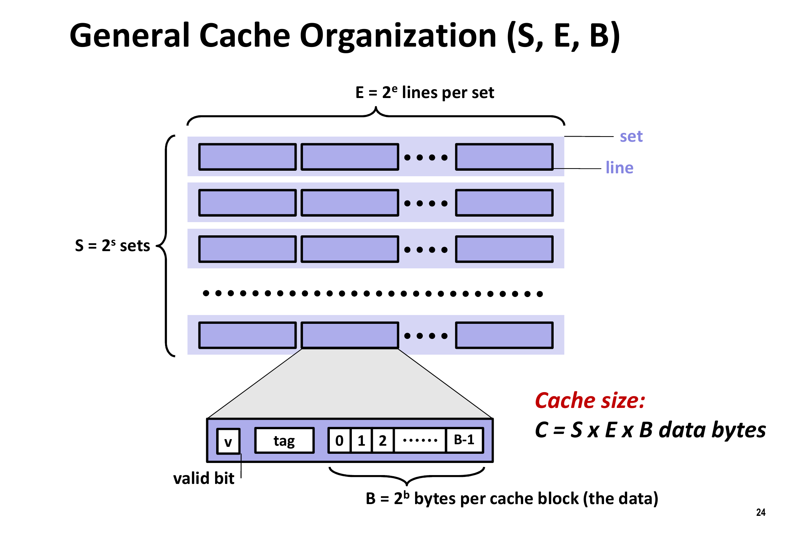

# Cache implementation

Now cache is added into the pipeline MIPS. 

```
.
├── lab4-pipeline-cache
│ 
├── cache.v
├── mips-pipeline.v
├── testbench.v
├── constrs.xdc
│ 
└── test.py
```

If you want to check my implementation, you only need to check `cache.v` and the Hazard module in `mips-pipeline.v`


## Structure

The address can be divided into three parts, such as

| Tag (b bits) | Set index (s bits) | Block offest (b bits) |
| ------------ | ------------------ | --------------------- |
| 31:5         | 5:4                | 3:0                   |

This plot illustrates the organization of cache. (refer to [here](https://cs.slu.edu/~fritts/CSCI224_S15/schedule/chap6-cache-memory.pdf))

<div align="center">
    </img>
</div>


where "line" is the same as "block".

In my implementation, the number of set and size of block can be dynamically changed by macro define (at the beginning of `cache.v`). Typically, a 4 set (s=2) with block size of 16 bytes (b=4) is set by default. 

- Two-way set: i.e. 2 blocks/lines per set

- Replacement policy: naive **LRU** since I only have 2 blocks in a set. 


## Read/Write Policy

- Read Data
  - Hit: Just read it
  - Miss: **Read allocate**, i.e. read data from memory and allocate it to cache (update cache). This may cause a replacement, where I use the two-way LRU policy.
- Write Data (a little optimization can be applied here, we'll come back to that)
  - Hit: **Write back**, i.e. assert "dirty" and write only to cache. It is much more efficient than *write through*, which writes to memory as well.
  - Miss: **No write allocate** (write-around), i.e. bypass cache (not write/allocate cache) and write directly into Memory


## Optimization

As is stated above, I apply an optimization on writing data. Notice that writing to memory can cause wasting time, when CPU is waiting for memory. Thus my idea is to **let CPU continue to run** as if the writing were finished immediately. Since my Memory can not execute several reads/writes at a time, it should be halt whenever the next instruction is going to use Memory but the Memory is currently executing the write task assigned before. The advantage of doing so is that we can then make fuller use of the hardware, thus improving the overall performance of CPU. In practice, it makes a great improvement on my program, where accessing memory is not quite intensive, as shown in the [Simulation](#Simulation) section.

Similarly, in the case of Memory reading, we can also let CPU continue to run until the destination register (i.e. Regdst of currently instruction, e.g. `LW`, that is reading memory) is needed or memory is need. Besides, we need other registers to save the state of current reading-memory instruction and need to resume it to *Writeback* stage as soon as it finishes reading. The hazard control will then be much more complicated so I haven't implemented this.


## Simulation

The simulation program is the demo program, which can be simply considered as some push and pop and ALU computation. We are just interested in `push` and `pop`. Here is a cheat sheet about how to implement push and pop in assembly of MIPS.

```assembly
# PUSH
ADDI $sp, $sp, -4 # sp -= 4
SW $ra, 0($sp) # Store Return Address
......
# POP
ADDI $sp, $sp, 4 # sp += 4
LW $ra, 0($sp) # Load Return Address
```

Then we can forget the detail and just keep in mind that it's just a program with some pushes and pops. Now, let's have a look at the simulation result.

<div align="center">
    
</div>
where 0, 4, 2 is the state of cache. Specifically, 0 for idle, 1 for comparing tags (just simulate the delay), 2 for allocation (reading data from memory to cache when read miss occurs), 3 for write back (writing back dirty blocks), 4 for write-around). We can easily see that the optimization works in this case, which saves about half of the writing time, marked in yellow rectangles.


## Hit/Miss Rate

Since my program is mainly calculation and the instructions that access Memory is those `push` and `pop` before calling a function or after returning to the caller. Since the stack is consecutive, which is quite suitable for cache mechanism, pushing and popping (at exactly the same address) both only need to modify cache, thus my hit rate is almost $100\%$.(Of cause, that's great but impossible in practice...)

