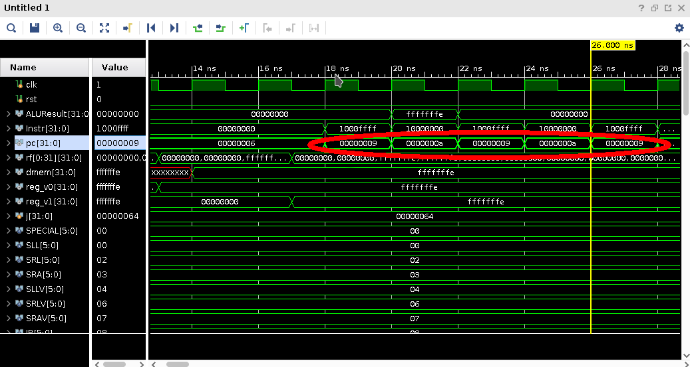

# Pipelined MIPS Implementation

File Structure

```
.
├── lab3-pipeline: The Vivado project
│ 
├── mips-pipeline.v: Design source
├── testbench.v: Simulation source
├── constrs.xdc: Constraints
│ 
└── test.py: Demo checker
```


## Supported Instructions

Same as before, 40+ instructions are supported, which is shown below.

- R-Type

| Func   | rs     | rt     | rd     | shift (shamt) | Opcode |
| ------ | ------ | ------ | ------ | ------------- | ------ |
| 6 bits | 5 bits | 5 bits | 5 bits | 5 bits        | 6 bits |

| Instr |  Func  | Opcode | Format            | Description                                 |
| ----- | :----: | :----: | ----------------- | ------------------------------------------- |
| SLL   | 000000 | 000000 | `SLL rd, rt, sa`  | `GPR[rd] ← GPR[rt] << sa`                   |
| SRL   | 000000 | 000010 | `SRL rd, rt, sa`  | `GPR[rd] ← GPR[rt] >> sa (logical)`         |
| SRA   | 000000 | 000011 | `SRA rd, rt, sa`  | `GPR[rd] ← GPR[rt] >> sa (arithmetic)`      |
| SLLV  | 000000 | 000100 | `SLLV rd, rt, rs` | `GPR[rd] ← GPR[rt] << GPR[rs]`              |
| SRLV  | 000000 | 000110 | `SRLV rd, rt, rs` | `GPR[rd] ← GPR[rt] >> GPR[rs] (logical)`    |
| SRAV  | 000000 | 000111 | `SRAV rd, rt, rs` | `GPR[rd] ← GPR[rt] >> GPR[rs] (arithmetic)` |
| JR    | 000000 | 001000 | `JR rs`           | `PC ← GPR[rs]`                              |
| JALR  | 000000 | 001001 | `JALR rd, rs`     | `GPR[rd] ← PC + 4, PC ← GPR[rs]`            |
| ADD   | 000000 | 100000 | `ADD rd, rs, rt`  | `GPR[rd] ← GPR[rs] + GPR[rt]`               |
| ADDU  | 000000 | 100001 | `ADDU rd, rs, rt` | `GPR[rd] ← GPR[rs] + GPR[rt]`               |
| SUB   | 000000 | 100010 | `SUB rd, rs, rt`  | `GPR[rd] ← GPR[rs] - GPR[rt]`               |
| SUBU  | 000000 | 100011 | `SUBU rd, rs, rt` | `GPR[rd] ← GPR[rs] - GPR[rt]`               |
| AND   | 000000 | 100100 | `AND rd, rs, rt`  | `GPR[rd] ← GPR[rs] AND GPR[rt]`             |
| OR    | 000000 | 100101 | `OR rd, rs, rt`   | `GPR[rd] ← GPR[rs] OR GPR[rt]`              |
| XOR   | 000000 | 100110 | `XOR rd, rs, rt`  | `GPR[rd] ← GPR[rs] XOR GPR[rt]`             |
| NOR   | 000000 | 100111 | `NOR rd, rs, rt`  | `GPR[rd] ← GPR[rs] NOR GPR[rt]`             |
| SLT   | 000000 | 101010 | `SLT rd, rs, rt`  | `GPR[rd] ← (GPR[rs] < GPR[rt])`             |
| SLTU  | 000000 | 101011 | `SLTU rd, rs, rt` | `GPR[rd] ← (GPR[rs] < GPR[rt])`             |
| MUL   | 011100 | 000010 | `MUL rd, rs, rt`  | `GPR[rd] ← GPR[rs] × GPR[rt]`               |

- I-Type

| Opcode | rs (base) | rt     | IMM     |
| ------ | --------- | ------ | ------- |
| 6 bits | 5 bits    | 5 bits | 16 bits |

| Instr | Opcode | Format                    | Description                            |
| ----- | ------ | ------------------------- | -------------------------------------- |
| BEQ   | 000100 | `BEQ rs, rt, offset`      | `if GPR[rs] = GPR[rt] then branch`     |
| BNE   | 000101 | `BEQ rs, rt, offset`      | `if GPR[rs] ≠ GPR[rt] then branch`     |
| BLEZ  | 000110 | `BLEZ rs, offset`         | `if GPR[rs] ≤ 0 then branch`           |
| BGTZ  | 000111 | `BGTZ rs, offset`         | `if GPR[rs] > GPR[rt] then branch`     |
| ADDI  | 001000 | `ADDI rt, rs, immediate`  | `GPR[rt] ←  GPR[rs] + immediate`       |
| ADDIU | 001001 | `ADDIU rt, rs, immediate` | `GPR[rt] ← GPR[rs] + immediate`        |
| SLTI  | 001010 | `SLTI rt, rs, immediate`  | `GPR[rt] ← (GPR[rs] < immediate)`      |
| SLTIU | 001011 | `SLTIU rt, rs, immediate` | `GPR[rt] ← (GPR[rs] < immediate)`      |
| ANDI  | 001100 | `ANDI rt, rs, immediate`  | `GPR[rt] ← GPR[rs] AND immediate`      |
| ORI   | 001101 | `ORI rt, rs, immediate`   | `GPR[rt] ← GPR[rs] OR immediate`       |
| XORI  | 001110 | `XORI rt, rs, immediate`  | `GPR[rt] ← GPR[rs] XOR immediate`      |
| LUI   | 001111 | `LUI rt, immediate`       | `GPR[rt] ← immediate << 16`            |
| LB    | 100000 | `LB rt, offset(base)`     | `GPR[rt] ← memory[GPR[base] + offset]` |
| LH    | 100001 | `LH rt, offset(base)`     | `GPR[rt] ← memory[GPR[base] + offset]` |
| LW    | 100011 | `LW rt, offset(base)`     | `GPR[rt] ← memory[GPR[base] + offset]` |
| LBU   | 100100 | `LBU rt, offset(base)`    | `GPR[rt] ← memory[GPR[base] + offset]` |
| LHU   | 100101 | `LHU rt, offset(base)`    | `GPR[rt] ← memory[GPR[base] + offset]` |
| SB    | 101000 | `SB rt, offset(base)`     | `memory[GPR[base] + offset] ← GPR[rt]` |
| SH    | 101001 | `SH rt, offset(base)`     | `memory[GPR[base] + offset] ← GPR[rt]` |
| SW    | 101011 | `SW rt, offset(base)`     | `memory[GPR[base] + offset] ← GPR[rt]` |

- J-Type

| Opcode | Address |
| ------ | ------- |
| 6 bits | 26 bits |

| Instr | Opcode | Format       |
| ----- | ------ | ------------ |
| J     | 000010 | `J target`   |
| JAL   | 000011 | `JAL target` |
| NOP   | 000000 | `NOP`        |


For pipelined design, the support for `JR`, `JAL` and `JALR` are quite similar since we can simply consider them as the combination of jump and write registers (if necessary). Next address to jump is specified by either the immediate field (`J` and `JAL`) or value in register located by the rd field of the instruction (`JR` and `JALR`) . And the destination registers to write is either `$ra` (`JAL`) or the rs field of the instruction (`JALR`) .


## Datapath Overview

Nothing better than a circuit.

<div align="center">
    
</div>


In summary, I mainly add the follow control signals:

- ALUSrcA: Operand A of ALU is rs or shamt(used in *Shift* instruction such as `SLL`)
- Branch(not shown): Control the Compare unit in the figure, used to compare the operands of Branch instruction

- PCSrc: Next PC of current instruction is `PC+4` or offset(*Branch*) or immediate(`J`, `JAL`) or a register value(`JR`, `JALR`). 
- MemWidth, MemSign: Control the width of read/write data and sign-extended or zero-extended of read data in Memory.

And nuance in Hazard unit:

- TakenD: 1 if next PC is not simply PC plus 4, called "Taken", which is the case of all *Jump* instructions as well as *Branch* taken instructions. Obviously, it is used to check control hazards.
- BranchOrJumpRegD: 1 if *Branch* instruction or `JR` or `JALR` is executing in Decode stage, which probably need to forward value from Memory or perform a stalling when the dependent value haven't been computed out. 


## Demo

The demo is the same as in my implementation of single-cycle as well as multi-cycle. Recall that it is simply a random number generator, which given a seed and outputs some pseudo-random numbers in sequence, using the algorithm called *linear congruential generator* (*LCG*). We can just consider it as a function, whose input is an integer (i.e. a seed) and outputs are some random integers. A simple python program `test.py` is also provided to check the correctness of the outputs.

### Usage

- SW[0] is **Reset** trigger. During the positive edge of clock signal, PC wiil be set to 0 whenever SW[0] is 1.
- SW[1] is **Load** trigger. It will set the seed of our generator to the binary value represented by SW[15:4], if both SW[1] and SW[0] are 1. After loading, we can set SW[0] back to 0, restarting the CPU with PC at 0.
- SW[2] is **Pause** trigger. Clock signal will stop flipping and CPU will pause when SW[2] is 1.
- SW[3] is **Slower** trigger. Clock signal will slow down to about 1.4hz (i.e. about one clock cycle per second) when SW[3] is 1.


## Simulation

The most difficult part of pipelined design is *hazard* control, occurring when one instruction is *dependent* on the results of another that has not yet completed. 

Thus to show my CPU design correct, I have test it on plenty of carefully designed offensive codes, which provide such hazards in several ways. I simply omit the thorough simulation for all supported instructions  since they are quite easy to deal with comparing with hazards.

All of the simulation codes are included in `testbench.v` with their expected result to check. 


### Data Hazards

This is the hazards that occur when one instruction writes a register and subsequent instructions read this register, also called a *read after write* (*RAW*) hazard.

#### Solving Data Hazards with Forwarding

This occurs when current instruction need to read register that previous instruction writes. To design such test cases, just make the instructions as dependent as possible to each other like this one: 

```verilog
//Forward from Writeback
`ROM[0] = {LUI, r0, v0, 16'hffff};//v0 = 0xffff0000
`ROM[1] = {ORI, v0, v0, 16'hffff};//v0 = 0xffffffff
`ROM[2] = {SPECIAL, v0, v0, v0, 5'b0, ADD};// v0 = 0xfffffffe 
```

The result is quite trivial but still proves the correct handling of this kind of hazard issue.

<div align="center">
    
</div>


#### Solving Data Hazards with Stalling 

This happens when the instruction following `LOAD` need to read register that remains unknown until the `LOAD` instruction has loaded the value from Memory as shown below:

```verilog
//...where v0 = 0xffffffe
`ROM[3] = {SW, r0, v0, 16'b0};
`ROM[4] = {LW, r0, v1, 16'b0};//v1 = 0xfffffffe = -2
`ROM[5] = {BLEZ, v1, r0, 16'd3};//Not taken 
```

And the simulation for this subprogram is shown as below:

<div align="center">
    
</div>


A delay of three cycles (two by stalling, one by branch taken) is shown in the figure and after that PC change to 9 as expected, proving that our CPU handles the hazard correctly.


### Control Hazards

Control Hazards happens when the branch is mispredicted and all the previously pre-executed instructions after branch should be canceled. A simple program used to check this hazard is shown below: 

```verilog
//Control Hazard
`ROM[9] = {BEQ, r0, r0, 16'hffff};//HLT
`ROM[10] = {BEQ, r0, r0, 16'd0};//NOP
```

And the simulation result is 

<div align="center">
    
</div>


As shown in the figure, we can see that PC in Fetch stage oscillates in the end which is a branch instruction to the itself, causing the program to halt. However, the pipeline ceaselessly prefetches the next instruction(i.e. the second one `NOP`), and then cancels it, given that the branch is taken actually.


## Coding with Verilog Elegantly

When it come to writing test case for my CPU, writing the machine code is unavoidable. I am fully convinced that nobody will be happy to play with 0/1 to write instruction codes. Again and again, I heard that someone, after struggling with bugs for hours, finally found that the control signal was wrong due to careless encoding. Also, complaints flood in when mountains of trivial modification must be applied to the control signals after changing the width or adding new signals and so on...

However, a little trick is good to both the health of us and TA's, i.e. **using macro or parameter**, which can greatly improve the readability as well as flexibility. Well, let's see some examples to make it clear.


### Expressive Instruction Codes

First, at the very beginning of our source, add the macro such as:

```verilog
/* Opcode and Func macro */
parameter ADD = 6'b100000, ADDU = 6'b100001, OR = 6'b100101, SUB = 6'b100010;
/* ... */

/* Registers */
parameter r0 = 5'b0;
parameter v0 = 5'b00010, v1 = 5'b00011;//Return values from function
/* ... */
```

Writing instructions is then as simple as:

```
ROM[10] = {ORI, s0, a1, 16'd0};
ROM[11] = {ADDI, r0, a0, 16'd17};      
```


### Variable Length Control Signal 

In this case, we introduce a way to make our control signal variable-length and thus modifiable. An example of ALU Control is illustated (I know this guy may change its length several times when adding R-Type instructions...)

At the very beginning of our code, 

```verilog
`define CTL_WIDTH 31:0
`define CTL_WIDTH_NUM 32

`define CTL_ALUCONTROL 31:28 //4bits
`define ALUCONTROL_WIDTH 3:0

//ALU Control Signal
`define ALU_ADD 4'b0000
//...
```

Well, we can then access those signals as follows, and whenever we want to change the length for certain signal, we can simply change the macro and don't need to modify the code inside our module.

```verilog
wire [`CTL_WIDTH] CTL;
CTL[`CTL_ALUCONTROL] = ALU_ADD;
```

Another convenience of doing this is that the input or output of Control unit will be simplier since we only have to pass a CTL but not all messy signals. 


